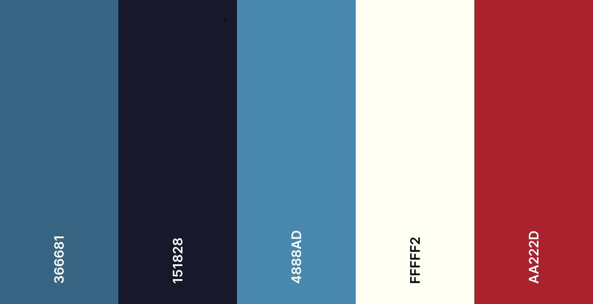

# Gold Splits #

Gold Splits is a platform for speedrunners of various games to gather together to discuss various topics. Post your new personal best times, start a discussion about strategies or create a guide on a route.

This platform will provide user's with a forum where they can:
- Post their own content including images and videos
- Read and like other users' posts
- Comment on other users' posts

The platform will also allow admins of the site to moderate and remove any inappropriate content and user's.

This project will use the Django framework for a MVC based application using Postgres databases to manage information.

## Table of contents 

- [UX](#ux)
    - [User Goals](#user-goals)
    - [User Stories](#user-stories)
    - [Owner's Goals](#owners-goals)
- [Design Choices](#design-choices)
    - [Structure](#structure)
    - [Wireframes](#wireframes)
    - [Colors & Fonts](#colors)
- [Features](#features)
    - [Existing Features](#existing-features)
    - [Potential Future Feature](#future-features)
- [Testing](#testing)

- [Deployment](#deployment)
    - [Local Deployment](#local-deployment)
    - [Heroku Deployment](#heroku)
- [Technologies](#technologies)
- [Credits](#credits)

## UX ##

### User Goals ###

### User Stories ###

### Owner's Goals ###

## Design Choices ##

### Structure ###

Below you will find the structure and models that are used in the database for this project. Diagram was created using [**DrawSQL**](https://drawsql.app/)

|   | Posts Model  |   |
|---|---|---|
| id  | IntegerField  |   |
| title  | CharField  |   |
| author | ForeignKey profile  | ManyToOne |
| date  | DateField  |   |
| timestamp  | TimeField  |   |
| content  | TextField  |   |
| likes  | IntegerField  |   |
| hero image  | URLField  |   |
| category  | ForgeignKey category  | ManyToOne  |
| slug  | SlugField  |   |

|   | Comments Model  |   |
|---|---|---|
| id  | IntegerField  |   |
| post  | ForeignKey posts  | ManyToMany  |
| user | ForeignKey profile | ManyToMany  |
| content  | TextField  |   |
| date  | DateField  |   |
| timestamp  | TimeField  |   |

|   | Profile Model  |   |
|---|---|---|
| id  | IntegerField  |   |
| user | ForeignKey auth.user | OneToOne  |
| bio  | TextField  |   |
| admin  | BooleanField  |   |

|   | Categories Model  |   |
|---|---|---|
| id  | IntegerField  |   |
| name | CharField |   |

### Wireframes ###

Wireframes have been made for desktop, tablet and mobile versions of each page of the site. Links to each can be found below. Wireframes were created using [**Balsamiq**](https://balsamiq.com/wireframes/)

- [**Homepage**](docs/wireframes/homepage)
    - [**Homepage Desktop**](docs/wireframes/homepage/homepage-desktop.png)
    - [**Homepage Tablet**](docs/wireframes/homepage/homepage-tablet.png)
    - [**Homepage Mobile**](docs/wireframes/homepage/homepage-mobile.png)

- [**Account Page**](docs/wireframes/account-page)
    - [**Account Page Desktop**](docs/wireframes/account-page/account-page-desktop.png)
    - [**Account Page Tablet**](docs/wireframes/account-page/account-page-tablet.png)
    - [**Account Page Mobile**](docs/wireframes/account-page/account-page-mobile.png)

- [**Article Page**](docs/wireframes/article-page)
    - [**Article Page Desktop**](docs/wireframes/article-page/post-desktop.png)
    - [**Article Page Tablet**](docs/wireframes/article-page/post-tablet.png)
    - [**Article Page Mobile**](docs/wireframes/article-page/post-mobile.png)

- [**Posts Page**](docs/wireframes/posts-page)
    - [**Posts Page Desktop**](docs/wireframes/posts-page/posts-page-desktop.png)
    - [**Posts Page Tablet**](docs/wireframes/posts-page/posts-page-tablet.png)
    - [**Posts Page Mobile**](docs/wireframes/posts-page/posts-page-mobile.png)

### Colors & Fonts ###

The Colors were chosen to give a cool tone with some matching lighter colors for accent pieces and to draw the attention.

The dark tone was chosen to keep the screen dark and easily readable in low light with room for contrast when needed.

Blue was chosen as the primary base tone to separate design from that of other popular game/speedrun related sites such as [**Twitch.tv**](https://twitch.tv) which uses purple and [**Speedrun.com**](https://speedrun.com) which is green.

## Features ##

### Existing Features ###

### Potential Future Features ###

## Testing ##

## Deployment ##

### Local Deployment ###

### Heroku Deployment ###

## Technologies ##

## Credits ##