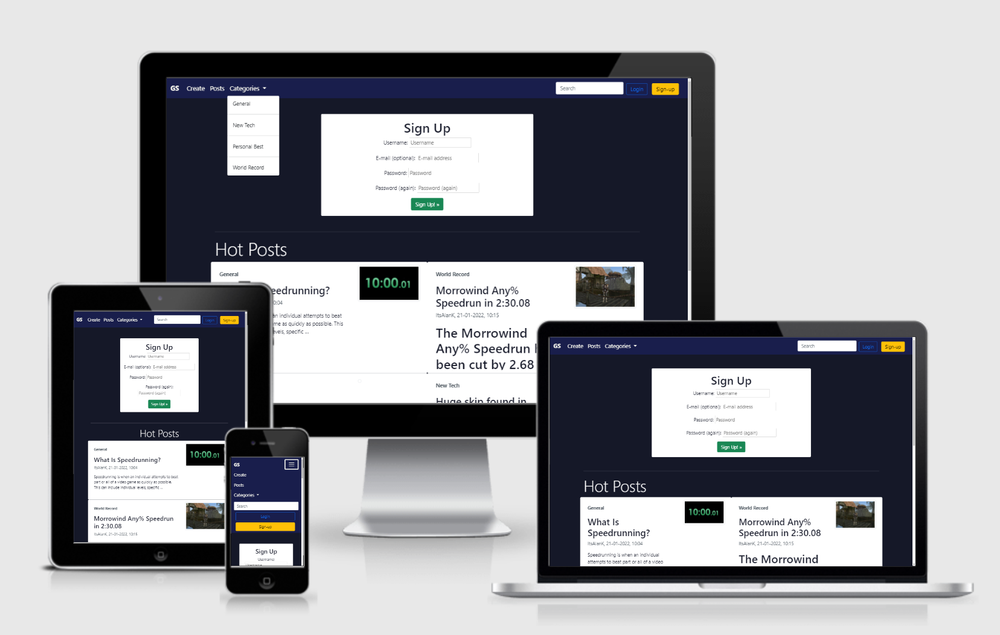
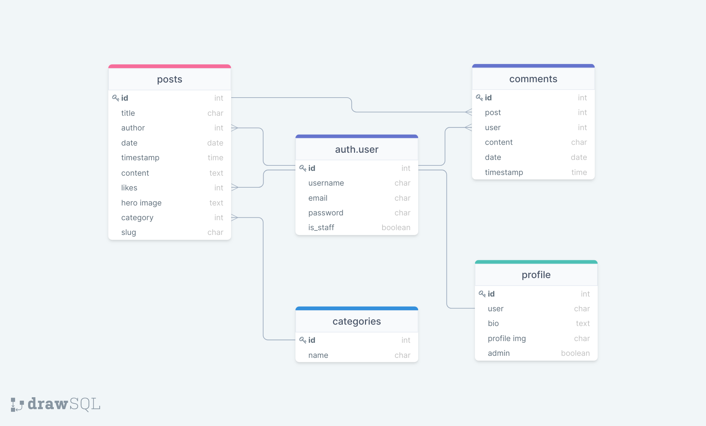
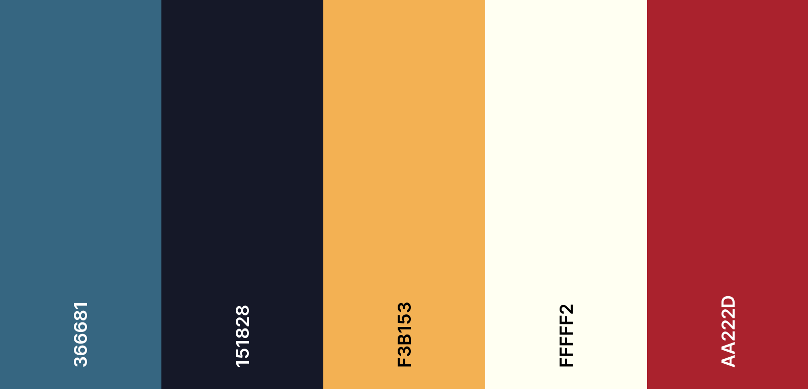

# Gold Splits #


Gold Splits is a platform for speedrunners of various games to gather together to discuss various topics. Post your new personal best times, start a discussion about strategies or create a guide on a route.

This platform will provide user's with a forum where they can:
- Post their own content including images and videos
- Read and like other users' posts
- Comment on other users' posts

The platform will also allow admins of the site to moderate and remove any inappropriate content and user's.

This project will use the Django framework for a MVC based application using Postgres databases to manage information.

[**Link to Live Site**](https://gold-splits.herokuapp.com/)

## Table of contents 

- [UX](#ux)
    - [Epics](#user-goals)
    - [User Stories](#user-stories)
- [Design Choices](#design-choices)
    - [Structure](#structure)
    - [Wireframes](#wireframes)
    - [Colors & Fonts](#colors)
- [Features](#features)
    - [Existing Features](#existing-features)
    - [Potential Future Feature](#future-features)
- [Testing](#testing)

- [Deployment](#deployment)
    - [Local Deployment](#local-deployment)
    - [Heroku Deployment](#heroku)
- [Technologies](#technologies)
- [Credits](#credits)

<a name="ux"></a>

## UX ##

<a name="user-goals"></a>

### Epics ###

Epics were used to identify the broad features and design considerations before breaking them down into the indivual user stories used to design the site.
1. As a user I can browse for posts I am interested in so that I can learn more about speedruns and games I am interested in.
2. As a user I can make posts in various categories to share my ideas and accomplishments with others
3. As a user I can like and comment on posts so that I can be involved in the community without creating posts.
4. As an admin I can manage posts so that content can be categorized and moderated.

<a name="user-stories"></a>

### User Stories ###

User Stories are grouped based on the epic they were distilled from.

- Epic One: Browsing Content
    - As a user I can view a list of posts on the site so that I can browse for posts I may be interested in
    - As a user I can refine the list of posts by search or category so that I can better browse for a particular game or topic
    - As a user I can click a specific post so that so that I can read its content
    - As a user I can see the date a post was created on so that I know which posts are most recent/relevant

- Epic Two: Creating Content
    - As a user I can register an account so that I can create posts and like and comment on others' posts
    - As a user I can create a post so that I can share my ideas/accomplishments on the platform
    - As a user I can upload images and videos to my post so that readers can watch my runs/clips and gain more context
    - As a user I can edit and delete my posts so that I can maintain my content as I wish

- Epic Three: Community Engagement
    - As a user I can view comments left on a post so that follow the discussion
    - As a user I can leave a like on posts so that I can give quick positive feedback on a post
    - As a user I can write, edit and delete comments on a post so that I can be involved in the discussions

- Epic Four: Admin Control
    - As an admin I can delete posts and users so that I can moderate the content on the platform
    - As an admin I can create categories so that users can add categories to their posts to organise content catalog
    - As an admin I can delete comments so that the comments sections of posts can be moderated

## Design Choices ##

<a name="structure"></a>

### Structure ###

Below you will find the structure and models that are used in the database for this project. Diagram was created using [**DrawSQL**](https://drawsql.app/)



|   | Posts Model  |   |
|---|---|---|
| id  | IntegerField  |   |
| title  | CharField  |   |
| author | ForeignKey profile  | ManyToOne |
| date  | DateTime  |   |
| content  | TextField  |   |
| likes  | IntegerField  |   |
| hero_image  | ImageField  |   |
| category  | ForgeignKey category  | ManyToOne  |
| slug  | SlugField  |   |
| featured  | BooleanField  |   |

|   | Comments Model  |   |
|---|---|---|
| id  | IntegerField  |   |
| post  | ForeignKey posts  | ManyToMany  |
| user | ForeignKey profile | ManyToMany  |
| content  | TextField  |   |
| date  | DateTime  |   |

|   | Profile Model  |   |
|---|---|---|
| id  | IntegerField  |   |
| user | ForeignKey auth.user | OneToOne  |
| bio  | TextField  |   |
| profile_img  | ImageField  |   |

|   | Categories Model  |   |
|---|---|---|
| id  | IntegerField  |   |
| name | CharField |   |
| description | CharField |   |

<a name="wireframes"></a>

### Wireframes ###

Wireframes have been made for desktop, tablet and mobile versions of each page of the site. Links to each can be found below. Wireframes were created using [**Balsamiq**](https://balsamiq.com/wireframes/)

- [**Homepage**](docs/wireframes/homepage)
    - [**Homepage Desktop**](docs/wireframes/homepage/homepage-desktop.png)
    - [**Homepage Tablet**](docs/wireframes/homepage/homepage-tablet.png)
    - [**Homepage Mobile**](docs/wireframes/homepage/homepage-mobile.png)

- [**Account Page**](docs/wireframes/account-page)
    - [**Account Page Desktop**](docs/wireframes/account-page/account-page-desktop.png)
    - [**Account Page Tablet**](docs/wireframes/account-page/account-page-tablet.png)
    - [**Account Page Mobile**](docs/wireframes/account-page/account-page-mobile.png)

- [**Article Page**](docs/wireframes/article-page)
    - [**Article Page Desktop**](docs/wireframes/article-page/post-desktop.png)
    - [**Article Page Tablet**](docs/wireframes/article-page/post-tablet.png)
    - [**Article Page Mobile**](docs/wireframes/article-page/post-mobile.png)

- [**Posts Page**](docs/wireframes/posts-page)
    - [**Posts Page Desktop**](docs/wireframes/posts-page/posts-page-desktop.png)
    - [**Posts Page Tablet**](docs/wireframes/posts-page/posts-page-tablet.png)
    - [**Posts Page Mobile**](docs/wireframes/posts-page/posts-page-mobile.png)

<a name="colors"></a>

### Colors & Fonts ###

The Colors were chosen to give a cool tone with some matching lighter colors for accent pieces and to draw the attention.

The dark tone was chosen to keep the screen dark and easily readable in low light with room for contrast when needed.

Blue was chosen as the primary base tone to separate design from that of other popular game/speedrun related sites such as [**Twitch.tv**](https://twitch.tv) which uses purple and [**Speedrun.com**](https://speedrun.com) which is green.



<a name="features"></a>

## Features ##

<a name="existing-features"></a>

### Existing Features ###

<a name="future-features"></a>

- User authentication, registration and sign in with Django allauth package.
- Sign up module on homepage when no user is signed in to support onboarding
- Dynamic profile related buttons in navbar.
    - Sign Up/Log In buttons when no user is logged in.
    - View Profile/Log Out buttons when a user is logged in.
- List of top posts sorted by most liked on home page with links to authors and and detail views of each post.
- A post page with featured post section displaying featured posts assigned through admin dashboard and selecting featured checkbox.
- Categorys pages to sort posts by category.
- Pagination on post and category pages.
- Search bar to query posts by title and content.
- User profile pages to display a profile picture and bio, _(not required)_
- Like and Comment functionality on posts
- Ability to create, edit and delete posts. Security checks included to ensure only the author of a post can edit that post.

### Potential Future Features ###

- Comment threads and replys to encourage more in depth conversation
- Ability to edit and remove comments from front end _(currently only available to admins)_
- Social Sign In with Facebook and Google.

<a name="testing"></a>

## Testing ##

<a name="deployment"></a>

## Deployment ##

This project is deployed to [Heroku](https://www.heroku.com/) which is where it is available to view publicly in a [Live Environment](https://gold-splits.herokuapp.com/). The project was developed using [Gitpod](https://gitpod.io/) with Github serving as host for my respository. This project can be deployed locally using and IDE such as gitpod or remote to a hosting platform such as Heroku.

For this project to work you will need an account on [Amazon AWS](https://aws.amazon.com/) with an [S3 bucket](https://docs.aws.amazon.com/AmazonS3/latest/userguide/UsingBucket.html) set up in order to store static files and uploaded media files.

<a name="local-deployment"></a>

### Local Deployment ###

These are the steps needed in order to deploy this project locally through an IDE such as gitpod:

1. Clone the project. Navigate to the repository, above the window housing all of the application's files there is a code button which drops down into a clone window providing a link to clone the project. In your IDE terminal type the following using the link provided.
    ```
    git clone https://github.com/ItsAlanK/portfolio-tracker.git
    ```
2. Install the modules required for the application to run using the ```requirements.txt``` file. You can do this with the following command in your terminal.
    ```
    pip3 install -r requirements.txt
    ```
3. Create a file in your project root directory called ```env.py``` to store environment variables. These variables are referenced in ```settings.py``` and are used to set security keys and other sensitive information that should not be hardcoded into the project.
    ```
    import os


    os.environ["DATABASE_URL"] = 'YOUR DATABASE URL'
    os.environ["DJANGO_SECRET_KEY"] = 'YOUR_SECRET_KEY'
    os.environ["AWS_ACCESS_KEY_ID"] = 'YOUR_AWS_ACCESS_KEY_ID'
    os.environ["AWS_SECRET_ACCESS_KEY"] = 'YOUR_AWS_SECRET_ACCESS_KEY'
    os.environ["AWS_BUCKET_NAME"] = 'name of bucket created in aws'
    os.environ["DEVELOP"] = "1"
    ```
    Ensure you add this env.py file to your .gitignore file if you are pushing the project to a live repository to prevent leaking information. If you fail to do this, deactivate and change any keys stored in the file immediately.

    Your ```DATABASE_URL``` variable is not needed if you only intend to run on a local machine as the project uses a local database when debug is on however in a live environment this will be required. _(More on this in the live deployment)_
4.  Migrate the database models with the following terminal command

    ```
    python3 manage.py migrate
    ```
5. Create a superuser in order to access admin for site with the following command
    ```
    python3 manage.py createsuperuser
    ```
    And set up a username and password
6. Run the project with the following command:
    ```
    python manage.py runserver
    ```
    The terminal will provide you with the link to the server opened with this command.
7. To access the admin dashboard, add ```/admin``` to the end of the URL and user your superuser login details.


<a name="heroku"></a>

### Heroku Deployment ###

Create app, add postgres

Config vars

<a name="technologies"></a>

## Technologies ##

### Languages ###

- HTML
- CSS
- Python

### Libraries and Frameworks ###

- Bootstrap
- Font Awesome
- CKEditor

### Other ###

- Django
- AWS S3
- Heroku
- Postgres
- Git
- DrawSQL
- Balsamiq

<a name="credits"></a>

## Credits ##